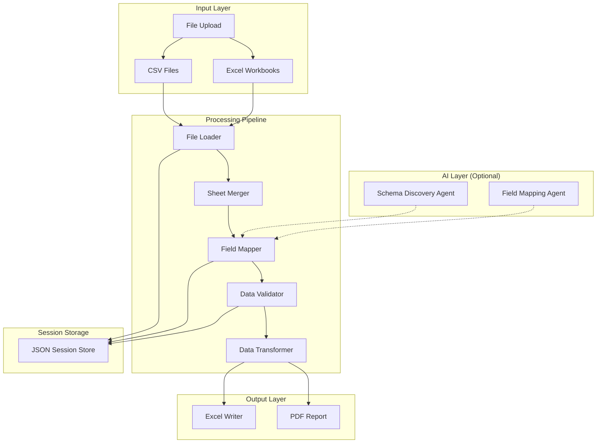

# Payroll Data Conversion Tool

[](https://www.python.org/downloads/)
[](https://fastapi.tiangolo.com/)
[](https://opensource.org/licenses/MIT)

A web-based tool for converting legacy payroll system exports to modern ERP-compatible formats. Built with FastAPI and designed for enterprise payroll migrations.

---

## Overview

Migrating payroll data between systems is complex, error-prone, and time-consuming. This tool automates the conversion of legacy payroll exports into standardized formats ready for import into modern ERP systems.

### Key Features

- **Multi-format Input Support** — Upload Excel workbooks, CSV files, or multiple files simultaneously
- **Intelligent Field Mapping** — Auto-suggest mappings using fuzzy matching with confidence scores
- **AI-Assisted Schema Discovery** — Automatically identify source table types and categorize columns
- **Comprehensive Validation** — SSN format, date ranges, state codes, required fields, and duplicate detection
- **Multi-sheet Processing** — Automatically merge related data from multiple Excel sheets
- **Interactive Review** — Preview transformed data before export with inline editing
- **Export Options** — Download converted data as Excel workbooks or PDF validation reports

### Problem Solved

Legacy payroll systems often export data in proprietary formats with:
- Cryptic column names (e.g., `SOCSCNUM`, `BRTHDATE`, `DEPRTMNT`)
- Data spread across multiple tables/sheets
- Inconsistent date and number formats
- Missing or malformed values

This tool handles all of these challenges, transforming messy legacy exports into clean, validated, import-ready files.

---

## Demo


*Complete workflow: Upload → Map Fields → Validate → Review → Export*

---

## Tech Stack

| Category | Technology |
|----------|------------|
| **Backend** | Python 3.10+, FastAPI, Uvicorn |
| **Data Processing** | Pandas, openpyxl |
| **Fuzzy Matching** | RapidFuzz |
| **Validation** | Pydantic, Custom validators |
| **AI Features** | Claude API (optional) |
| **PDF Reports** | ReportLab |
| **Frontend** | Jinja2 Templates, Bootstrap 5 |
| **Session Storage** | JSON-based file storage |

---

## Supported Formats

### Input Formats

| Format | Extensions | Description |
|--------|------------|-------------|
| Excel Workbook | `.xlsx`, `.xls`, `.xlsm` | Single or multi-sheet workbooks |
| CSV | `.csv` | Comma-separated values |
| TSV | `.tsv`, `.txt` | Tab-separated values |

### Output Formats

| Format | Description |
|--------|-------------|
| Excel Workbook | Multi-sheet output organized by data category |
| PDF Report | Validation summary with error details |

### Output Sheet Structure

The converted Excel output includes standardized sheets:

- **Payroll Employee** — Demographics, contact info, employment dates
- **Payroll Employee Salary** — Pay rates, salary configuration
- **Payroll Employee Deduction** — Benefits and deduction assignments
- **Employee State WH Setup** — State tax withholding configuration
- **US Federal WH Setup** — Federal tax withholding settings

---

## Installation

### Prerequisites

- Python 3.10 or higher
- pip (Python package manager)

### Setup

```bash
# Clone the repository
git clone https://github.com/yourusername/payroll-data-conversion.git
cd payroll-data-conversion

# Create virtual environment (recommended)
python -m venv venv
source venv/bin/activate  # On Windows: venv\Scripts\activate

# Install dependencies
pip install -r requirements.txt
```

### Optional: AI Features

To enable AI-assisted field mapping and schema discovery:

```bash
# Set your Anthropic API key
export ANTHROPIC_API_KEY=your_api_key_here  # On Windows: set ANTHROPIC_API_KEY=...
```

---

## Usage

### Starting the Application

```bash
# Start the web server
python -m uvicorn web.app:app --host 127.0.0.1 --port 8000 --reload
```

Then open your browser to `http://127.0.0.1:8000`

### Workflow Steps

1. **Upload** — Drag and drop or select your source file(s)
2. **Map Fields** — Review and adjust auto-suggested field mappings
3. **Validate** — Run validation checks and review any errors/warnings
4. **Review** — Preview the transformed data with inline editing
5. **Export** — Download the converted Excel file or PDF report

### Using Sample Data

The `/samples` directory includes synthetic test data:

```bash
# Sample files available:
samples/
├── sample_legacy_payroll_export.csv    # Simple single-file test
├── sample_employee_master.xlsx         # Multi-sheet workbook test
├── sample_deduction_codes.csv          # Reference: deduction codes
├── sample_earnings_codes.xlsx          # Reference: earnings codes
└── sample_output_template.xlsx         # Example converted output
```

To regenerate sample data:

```bash
python samples/generate_samples.py
```

---

## Project Structure

```
payroll-data-conversion/
├── src/
│   ├── agents/                 # AI agents for intelligent processing
│   │   ├── base.py            # Base agent class with Claude API integration
│   │   ├── schema_discovery.py # Auto-detect source table types
│   │   └── field_mapping.py   # AI-assisted field suggestions
│   ├── extractors/            # File loading and parsing
│   │   ├── file_loader.py     # Multi-format file reader
│   │   ├── file_merger.py     # Multi-sheet data merging
│   │   └── gp_patterns.py     # Source system column patterns
│   ├── mappers/               # Field mapping logic
│   │   ├── field_mapper.py    # Fuzzy matching and confidence scoring
│   │   └── type_inference.py  # Data type detection
│   ├── validators/            # Data validation
│   │   └── data_validator.py  # SSN, date, state, duplicate checks
│   ├── transformers/          # Data transformation
│   │   └── data_transformer.py # Value mapping and formatting
│   ├── models/                # Data models and mappings
│   │   ├── bc_template.py     # Target template definitions
│   │   └── gp_to_bc_mappings.py # Source-to-target field maps
│   ├── output/                # Output generation
│   │   ├── excel_writer.py    # Excel workbook creation
│   │   ├── pdf_report.py      # PDF validation reports
│   │   └── error_formatter.py # Error message formatting
│   └── storage/               # Session management
│       └── session_store.py   # JSON-based session persistence
├── web/
│   ├── app.py                 # FastAPI application and routes
│   ├── templates/             # Jinja2 HTML templates
│   │   ├── base.html          # Base layout
│   │   ├── index.html         # Upload page
│   │   ├── mapping.html       # Field mapping interface
│   │   ├── review.html        # Data review page
│   │   └── results.html       # Export/download page
│   └── static/
│       └── css/style.css      # Custom styles
├── samples/                   # Synthetic test data
├── docs/                      # Documentation
├── requirements.txt           # Python dependencies
└── README.md                  # This file
```

---

## Architecture



### Data Flow

1. **File Loading** — Parse uploaded files, detect headers, extract data
2. **Sheet Merging** — Combine related sheets using employee ID as key
3. **Field Mapping** — Match source columns to target fields with confidence scoring
4. **Validation** — Check data quality, format compliance, required fields
5. **Transformation** — Apply value mappings, format conversions, calculations
6. **Export** — Generate output files in target system format

---

## Validation Features

### Built-in Validators

| Validator | Description | Example |
|-----------|-------------|---------|
| **SSN Format** | Validates XXX-XX-XXXX pattern | `123-45-6789` ✓ |
| **Date Range** | Checks dates are within valid range | Birth date 1900-2024 |
| **State Codes** | Validates US state/territory codes | `MI`, `CA`, `PR` ✓ |
| **Required Fields** | Ensures critical fields are populated | Employee ID required |
| **Duplicate Detection** | Finds duplicate employee records | Flag duplicate SSNs |
| **Numeric Validation** | Validates numeric fields | Pay rate > 0 |

### Validation Severity Levels

- **Error** — Must be fixed before export (invalid SSN format)
- **Warning** — Review recommended (missing optional field)
- **Info** — Informational only (auto-corrected value)

### Field Mapping Confidence

| Level | Score | Description |
|-------|-------|-------------|
| **High** | ≥85% | Exact or known mapping match |
| **Medium** | 60-84% | Strong semantic similarity |
| **Low** | <60% | Requires manual review |

---

## AI Features

The application includes optional AI-powered features that enhance the conversion process:

### Schema Discovery Agent

Automatically identifies source table types by analyzing column signatures:

- Detects common payroll table patterns (Employee Master, Address, Tax Setup)
- Categorizes columns into semantic groups
- Routes fields to appropriate output sheets
- Works without AI (rule-based) or with Claude API (enhanced)

### Field Mapping Agent

Suggests intelligent field mappings based on:

- Column name semantics (`SOCSCNUM` → "Social Security No.")
- Sample data pattern analysis
- Known source-to-target mapping dictionary
- Fuzzy string matching with RapidFuzz

---

## Configuration

### Environment Variables

| Variable | Required | Description |
|----------|----------|-------------|
| `ANTHROPIC_API_KEY` | No | Enables AI-enhanced features |
| `HOST` | No | Server host (default: 127.0.0.1) |
| `PORT` | No | Server port (default: 8000) |

### Session Management

Sessions are stored as JSON files in the `sessions/` directory. Each session maintains:

- Uploaded file information
- Field mapping configuration
- Validation results
- Transformation state

Sessions expire after 24 hours of inactivity.

---

## Contributing

Contributions are welcome! Please follow these steps:

1. Fork the repository
2. Create a feature branch (`git checkout -b feature/amazing-feature`)
3. Commit your changes (`git commit -m 'Add amazing feature'`)
4. Push to the branch (`git push origin feature/amazing-feature`)
5. Open a Pull Request

### Development Setup

```bash
# Install development dependencies
pip install -r requirements.txt

# Run with auto-reload for development
python -m uvicorn web.app:app --reload --port 8000
```

### Code Style

- Follow PEP 8 guidelines
- Use type hints where applicable
- Include docstrings for public functions
- Write tests for new features

---

## License

This project is licensed under the MIT License - see the [LICENSE](LICENSE) file for details.

---

## About

Built as a solution for enterprise payroll data migration challenges. This tool demonstrates:

- **Data Engineering** — ETL pipelines, data validation, format transformation
- **Web Development** — FastAPI backend, responsive UI, session management
- **AI Integration** — Claude API for intelligent automation
- **Software Architecture** — Modular design, separation of concerns

### Contact

- GitHub: [@yourusername](https://github.com/yourusername)
- LinkedIn: [Your Name](https://linkedin.com/in/yourprofile)

---

## Acknowledgments

- [FastAPI](https://fastapi.tiangolo.com/) — Modern Python web framework
- [Pandas](https://pandas.pydata.org/) — Data manipulation library
- [RapidFuzz](https://github.com/maxbachmann/RapidFuzz) — Fast fuzzy string matching
- [Bootstrap](https://getbootstrap.com/) — CSS framework
- [Anthropic Claude](https://www.anthropic.com/) — AI assistance
